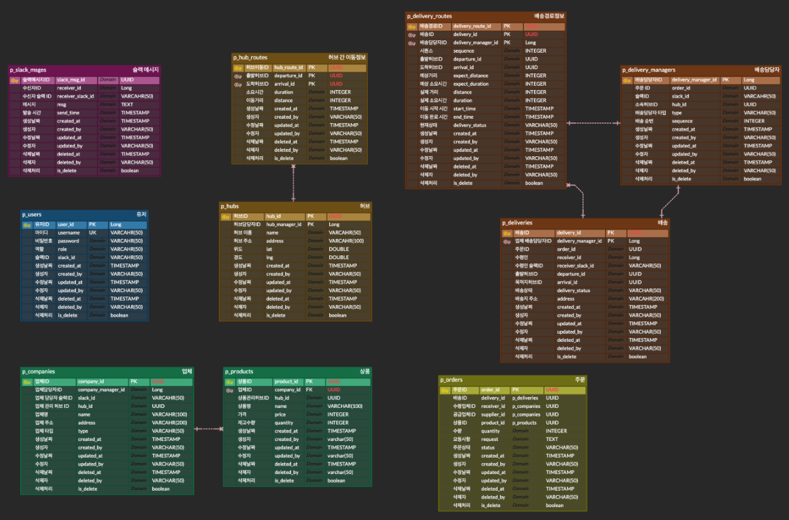

# 1. 프로젝트 소개

| 프로젝트명 | msa_delivery |
| --- | --- |
| 프로젝트 기간 | 24.12.05 ~ 24.12.17(13일) |
| 프로젝트 인원 | 4명(김예원, 김지수, 윤홍찬, 이현민) |

### 팀원 역할 분담

| 김예원 | order 서비스, slackMsg 서비스 |
| --- | --- |
| 김지수(팀장) | company 및 product 서비스, delivery 관련 서비스 |
| 윤홍찬 | eureka, gateway, auth 서비스, user 서비스 |
| 이현민 | hub 관련 서비스 |

<br /><br />

---

# 2. 프로젝트 목적/상세

- **MSA(Microservices Architecture)** 기반의 물류 관리 및 배송 시스템입니다. 다양한 물류 서비스(허브, 배송, 주문 등)를 개별 마이크로서비스로 분리하여 독립적으로 배포, 확장, 관리가 가능하도록 설계하였습니다. 이를 통해 **확장성**, **유지보수성**, **서비스 독립성**을 극대화하였습니다.

<br /><br />

---

# 3. 서비스 구성 및 실행방법

## 서비스 구성

<details>
  
- **Hub Service**
    - Hub
        - 허브 및 허브 경로 생성 - `POST /api/hubs`
        - 허브 및 허브 경로 수정 - `PUT /api/hubs/{id}`
        - 허브 및 허브 경로삭제 - `DELETE /api/hubs/{id}`
        - 허브 상세 조회 - `GET /api/hubs/{id}`
        - 허브 전체 조회 및 검색  - `GET /api/hubs`
    - Hub Route
        - 허브 경로 상세 조회 - `GET /api/hubs/hub-routes/{id}`
        - 허브 경로 전체 조회 및 검색  - `GET /api/hubs/hub-routes`
- **Delivery Service**
    - Delivery
        - 배송 및 배송 경로 생성 - `POST /api/deliveries`
        - 배송 수정 - `PUT /api/deliveries/{id}`
        - 배송 삭제 - `DELETE /api/deliveries/{id}`
        - 배송 상세 조회 - `GET /api/deliveries/{id}`
        - 배송 전체 조회 및 검색  - `GET /api/deliveries`
    - Delivery Route
        - 배송 경로 수정 - `PUT /api/deliveries/delivery-routes/{id}`
        - 배송 경로 삭제 - `DELETE /api/deliveries/delivery-routes/{id}`
        - 배송 경로 상세 조회 - `GET /api/deliveries/delivery-routes/{id}`
        - 배송 경로 전체 조회 및 검색  - `GET /api/deliveries/delivery-routes`
    - Delivery Manager
        - 배송 담당자 생성 - `POST /api/deliveries/delivery-managers`
        - 배송 담당자 수정 - `PUT /api/deliveries/delivery-managers/{id}`
        - 배송 담당자 삭제 - `DELETE /api/deliveries/delivery-managers/{id}`
        - 배송 담당자 상세 조회 - `GET /api/deliveries/delivery-managers/{id}`
        - 배송 담당자 전체 조회 및 검색  - `GET /api/deliveries/delivery-managers`
- **Company Service**
    - Company
        - 업체 생성 - `POST /api/companies`
        - 업체 수정 - `PUT /api/companies/{id}`
        - 업체 삭제 - `DELETE /api/companies/{id}`
        - 업체 상세 조회 - `GET /api/companies/{id}`
        - 업체 전체 조회 및 검색  - `GET /api/companies`
    - Product
        - 상품 생성 - `POST /api/companies/proudcts`
        - 상품 수정 - `PUT /api/companies/proudcts/{id}`
        - 상품 삭제 - `DELETE /api/companies/proudcts/{id}`
        - 상품 상세 조회 - `GET /api/companies/proudcts/{id}`
        - 상품 전체 조회 및 검색  - `GET /api/companies/proudcts`
- **Order Service**
    - 주문 생성 - `POST /api/orders`
    - 주문 수정 - `PUT /api/orders/{order_id}`
    - 주문 삭제 - `DELETE /api/orders/{order_id}`
    - 주문 상세 조회 - `GET /api/orders/{order_id}`
    - 주문 전체 조회 및 검색 - `GET /api/orders`
- **Slack Msg Service**
    - 슬랙 메시지 생성 - `POST /api/slack/messages`
    - 슬랙 메시지 수정 - `PUT /api/slack/messages/{slack_msg_id}`
    - 슬랙 메시지 삭제 - `DELETE /api/slack/messages/{slack_msg_id}`
    - 슬랙 메시지 상세 조회 - `GET /api/slack/messages/{slack_msg_id}`
    - 슬랙 메시지 전체 조회 및 검색 - `GET /api/slack/messages`
- **User Service**
    - 유저 수정 - `PUT /api/users/{id}`
    - 유저 삭제 - `DELETE /api/users/{id}`
    - 유저 상세 조회 - `GET /api/users/{id}`
    - 유저 전체 조회 및 검색 -  `GET /api/users`
- **Auth Service**
    - 회원가입 - `POST /api/auth/sign-up`
    - 로그인 - `POST /api/auth/sign-in`

</details>

<br />

## 실행방법

- Docker

<br /><br />

---

# 4. ERD



<br /><br />

---

# 5. 기술 스택

- **프로그래밍 언어**: Java 17
- **프레임워크**: Spring Boot 3.4.0
- **데이터베이스**: PostgreSQL
- **API 문서화**: Swagger
- **아키텍처**: MSA 기반 (Spring Cloud)
- **CI/CD**: Docker, Docker-Compose
- **모니터링 및 분산 추적**: Zipkin, Actuator
- **알림**: Slack API

<br /><br />

---

# 6. 트러블 슈팅

- 김예원

  <details>
  
    - 트러블슈팅
        
        ### **트러블슈팅 1. 보상 트랜잭션**
        
        ---
        
        ### **문제정의**
        
        **문제**: 주문 생성 시 재고 차감 후 다른 로직에서 예외 발생 시, 이미 차감된 재고를 복구해야 하는 상황.
        
        **문제라고 생각한 이유**:
        
        - 재고 차감 후 주문 생성 과정에서 예외가 발생하면, 이미 차감된 재고를 복구해야 하므로 이를 처리하는 로직이 필요하다.
        - 별도의 `restoreProductQuantity` 메서드를 만들어 복구를 처리하는 방식은 코드 중복을 초래하고, 유지보수에 어려움을 주는 문제를 발생시킬 수 있다.
        
        ---
        
        ### **해결과정**
        
        **1. 문제 파악**
        
        - 주문 생성 중 예외가 발생하면 이미 차감된 재고를 복구해야 한다.
        - `restoreProductQuantity`라는 별도 메서드를 사용하여 재고 복구를 진행하게 되면 코드 중복을 발생시키고 유지보수의 복잡도를 높이는 문제점이 있었다.
        
        **2. 해결 방법 탐색**
        
        - 코드 중복을 피하기 위해 기존의 `reduceProductQuantity(productId, quantity)` 메서드를 재사용하는 방법을 고려했다.
        - 음수 값을 사용하여 재고를 차감하고 복구할 수 있도록 하여, 별도의 복구 메서드를 만들지 않고 하나의 메서드로 재고 차감과 복구를 모두 처리하도록 했다.
        
        **3. 적용 및 테스트**
        
        - `productService.reduceProductQuantity(orderRequestDto.getProduct_id(), -orderRequestDto.getQuantity())`를 사용하여 음수 값을 통해 재고 복구를 처리하였다.
        - 예외가 발생하면 보상 트랜잭션을 수행하여 재고를 복구하고, 예외 처리를 통해 안정성을 확보했다.
        
        ---
        
        ### **결과**
        
        **AS-IS**:
        
        - 재고 차감과 복구 로직을 별도의 메서드로 분리하여 코드 중복이 발생하고, 유지보수가 어려운 상황이었다.
        - 예외 발생 시 재고 복구를 위해 별도의 로직을 추가해야 했다.
        
        **TO-BE**:
        
        - 하나의 메서드 `reduceProductQuantity`로 재고 차감과 복구를 모두 처리할 수 있게 하였다.
        - 예외 발생 시 보상 트랜잭션을 통해 재고를 복구하고, 예외 처리를 통해 **시스템 안정성을 높였다.**
        
        **개선된 점**:
        
        - 코드 중복을 최소화하고 유지보수성을 개선했다.
        - 보상 트랜잭션을 통해 실패한 작업을 원래 상태로 되돌릴 수 있어 **시스템 안정성이 향상**되었다.
        - 음수 값을 활용한 재고 복구 방법을 통해 메서드를 재활용할 수 있게 되어 코드가 간결해졌다.
        
        ---
        
        ### **트러블슈팅 2. Gemini API 연결**
        
        ---
        
        ### **문제정의**
        
        **문제**: 주문 서비스에서 사용한 `GeminiRequestDto` 와 `GeminiResponseDto`가 Gemni API 요구사항에 맞지 않았다.
        
        **문제라고 생각한 이유**: 기존 `GeminiRequestDto` 와 `GeminiResponseDto`는 각각 필드 하나씩만을 가지고 있는 단순한 구조로 이루어져 있었으나, Gemini API에서는 복잡한 구조의 요청 데이터를 필요로 했다. 이로 인해 API 호출 시 데이터 형식 불일치 문제가 발생했다.
        
        ---
        
        ### **해결과정**
        
        **1. 문제 파악**
        
        - 기존 `GeminiRequestDto` 와 `GeminiResponseDto`는 Gemini API에서 요구하는 형식과 맞지 않아, 단일 필드로는 요청을 처리할 수 없었다. Gemini API는 복잡한 구조의 데이터 형식을 필요로 했다.
        - 기존 코드 :
            - `GeminiRequestDto` :
            
            ```java
            public class GeminiRequestDto {
            
                private String prompt; // AI에 보낼 자연어 프롬프트
            
                public static GeminiRequestDto fromOrderData(
                    String productInfo,
                    String requestDetails,
                    String departure,
                    String waypoints,
                    String destination
                ) {
                    String prompt = String.format(
                        "당신은 물류 발송 일정 전문가입니다.\n" + ,,,
                    );
                    return new GeminiRequestDto(prompt);
                }
            }
            ```
            
            - `GeminiResponseDto` :
            
            ```java
            @Data
            public class GeminiResponseDto {
            private String finalDeliveryTime;
            }
            ```
            
        
        **2. 해결 방법 탐색**
        
        - 요청 데이터와 응답 데이터 형식을 Gemini API에 맞게 변경해야 했다. `GeminiRequestDto` 를`prompt`를 포함하는 단일 필드 형식에서 여러 부분으로 구성된 `Content`와 `Part` 객체들을 포함하는 형태로 DTO를 수정하였으며, `GeminiResponseDto` 를  `finalDeliveryTime`  단일 필드에서 `candidates` 를 포함하는 형태의 DTO로 수정하였다.
        
        **3. 적용 및 테스트**
        
        - DTO 구조를 수정한 후, 기존 `GeminiRequestDto`를 새로운 구조로 변경하여 요청을 보냈다. 이 수정된 구조는 Gemini API에서 요구하는 형식에 맞게 데이터를 전달했다.
        - 응답 DTO인 `GeminiResponseDto`도 후보 리스트(`candidates`)와 그 안의 내용(`content`, `parts`, `text`)을 포함하도록 수정하여, 결과에서 발송 시한을 올바르게 추출할 수 있도록 했다.
        - 변경된 코드 :
            - `GeminiRequestDto` :
            
            ```java
            public class GeminiRequestDto {	
            	private List<Content> contents; // contents 필드 추가
            	
            	public static GeminiRequestDto fromOrderData(
            	    String productInfo,
            	    String requestDetails,
            	    String departure,
            	    String waypoints,
            	    String destination
            	) {
            	    String prompt = String.format(
            	        "당신은 물류 발송 일정 전문가입니다.\\n" + ,,,
            	    );
            	
            	    Part part = new Part(prompt);
            	    Content content = new Content(Collections.singletonList(part));
            	    return new GeminiRequestDto(Collections.singletonList(content));
            	}
            	
            	@Getter
            	@Setter
            	@NoArgsConstructor
            	@AllArgsConstructor
            	public static class Content {
            	    private List<Part> parts;
            	}
            	
            	@Getter
            	@Setter
            	@NoArgsConstructor
            	@AllArgsConstructor
            	public static class Part {
            	    private String text;
            	}
            }
            
            ```
            
            - `GeminiResponseDto` :
            
            ```java
            package com.msa_delivery.order.application.dto;
            
            import lombok.Data;
            
            import java.util.List;
            
            @Data
            public class GeminiResponseDto {	
            	private List<Candidate> candidates;
            	
            	@Data
            	public static class Candidate {
            	    private Content content;
            	}
            	
            	@Data
            	public static class Content {
            	    private List<Part> parts;
            	}
            	
            	@Data
            	public static class Part {
            	    private String text;
            	}
            	
            	// 최종 발송 시한 추출 메서드
            	public String getFinalDeliveryTime() {
            	    if (candidates != null && !candidates.isEmpty()) {
            	        return candidates.get(0)  // 첫 번째 후보
            	                .getContent()
            	                .getParts()
            	                .get(0)  // 첫 번째 part
            	                .getText();
            	    }
            	    return null;
            	}
            }
            ```
            
        
        ---
        
        ### **결과**
        
        **AS-IS**:
        
        - 기존 `GeminiRequestDto`는 `prompt` 문자열만 포함, Gemini API에서 요구하는 데이터 형식에 맞지 않았다.
        - Gemini 응답 처리도 `finalDeliveryTime` 추출에 오류가 있을 수 있었다.
        
        **TO-BE**:
        
        - 새로운 `GeminiRequestDto`는 복잡한 구조를 가진 `contents`, `Content`, `Part` 클래스를 포함하도록 수정하였다.
        - `GeminiResponseDto`는 응답 데이터를 적절히 처리할 수 있도록 수정되어, 발송 시한을 정확히 추출할 수 있게 되었다.
        
        **개선된 점**:
        
        - 요청 및 응답 DTO 구조가 Gemini API의 요구사항에 맞게 개선되었다.
        - 발송 시한을 정확하게 추출할 수 있는 기능이 추가되어, AI 결과를 활용할 수 있게 되었다.

  </details>

- 김지수

  <details>
  
    - 트러블 슈팅 1
        
        ### **트러블슈팅1. Gateway Path 설정**
        
        ---
        
        ### **문제정의**
        
        **문제**: Gateway Path 설정 시 특정 경로(`/api/deliveries`, `/api/delivery-routes`, `/api/delivery-managers`)가 정확히 인식되지 않아 요청이 서비스로 전달되지 않음.
        
        **문제라고 생각한 이유**:
        
        - API Gateway에서 각 `Path`를 개별적으로 설정했지만, 게이트웨이의 라우팅 동작에서 예상과 다르게 동작하여 일부 경로는 정상적으로 매칭되지 않아 **예상치 못한 경로 누락** 문제가 발생.
        
        ---
        
        ### **해결과정**
        
        **1. 문제 파악**
        
        - 기존 API 경로:
            - `/api/deliveries/**`
            - `/api/delivery-routes/**`
            - `/api/delivery-managers/**`
        - 기존  라우팅 `Path` 설정:
            
            ```yaml
            - id: delivery-service
              uri: lb://delivery-service
              predicates:
                - Path=/api/deliveries/**
                - Path=/api/delivery-routes/**
                - Path=/api/delivery-managers/**
            ```
            
        - **문제**:
            - 개별 나열된 `Path`가 충돌하거나 제대로 매칭되지 않아 라우팅이 실패함.
        
        **2. 해결 방법 탐색**
        
        - **API 경로를 통합**하고 하위 경로를 구조화한 뒤, 하나의 **Root Path**로 관리하도록 변경:
        - **변경 후 API 경로**
            - 모든 경로를 `/api/deliveries/**` 아래로 통합:
                - `/api/deliveries/**`
                - `/api/deliveries/delivery-routes/**`
                - `/api/deliveries/delivery-managers/**`
        - **변경 후 Gateway 설정**
            - **Root Path를 통합적으로 정의**:
                
                ```yaml
                - id: delivery-service
                  uri: lb://delivery-service
                  predicates:
                    - Path=/api/deliveries/**
                ```
                
        
        **3. 적용 및 테스트**
        
        - 설정 변경 후 **모든 API 요청**이 정상적으로 전달되는지 테스트 진행.
        - `/api/deliveries`와 하위 경로에 대한 요청이 **올바른 서비스로 라우팅**되는지 확인.
        
        ---
        
        ### **결과**
        
        **AS-IS**:
        
        - 개별 `Path` 설정으로 인해 일부 경로가 인식되지 않아 API Gateway를 통해 전달되지 않는 문제가 발생.
        - 예: `/api/delivery-managers` → 라우팅 실패
        
        **TO-BE**:
        
        - **Root Path** 하나로 설정하여 API 구조 수정 후, 모든 API 에 정상적으로 전달
        - 예: `/api/deliveries/delivery-managers` → 정상적으로 전달
        
        **개선된 점**:
        
        - **Root Path** 하나의 경로로 모든 하위 경로를 한 번에 처리함으로써 라우팅 오류 해결로 **서비스 안정성 확보**.
        
        ---
        
    - 트러블 슈팅 2
        
        ### 트러블슈팅 2: FeignClient로 서비스 통신 시 요청/응답 형식 불일치
        
        ---
        
        ### **문제정의**
        
        **문제 : 데이터 타입과 필드명, 요청/응답 형식이 일치하지 않으면 서비스 간 통신이 원활히 이뤄지지 않아 값을 제대로 가져오지 못하는 문제**
        
        문제라고 생각한 이유 :
        
        - MSA에서는 **서로 독립된 여러 서비스**가 네트워크를 통해 데이터를 주고받기 때문에, **통신 규격과 데이터 형식의 일관성**이 매우 중요
        
        ---
        
        ### **해결과정**
        
        1. **문제 파악**
            1. 서비스 간 데이터 전송 시 DTO 타입 또는 필드명이 일치하지 않으면 데이터가 누락되거나 전송에 실패함.
                - `delivery` 서비스 응답의  `managerId` 필드는 `Long` 타입이지만, `order` 서비스의`deliveryDto`에서는 `UUID` 타입으로 정의되어 충돌 발생.
                - `status` 필드를 `HttpStatus`로 정의 후 `.value()` 메서드를 사용해 숫자를 꺼내는 방식과 처음부터 `int` 타입으로 받아오는 방식의 차이로 파싱 오류 발생.
                - 필드의 명칭이 서로 다르면 매핑이 실패함.
            2. FeignClient 호출 시, 필수로 요구되는 헤더 값(`X-User_Id`, `X-Username`, `X-Role`)이 누락되어 요청이 실패함.
                - 유저 서비스는 필수 헤더를 요구하지만, `delivery` 서비스의 `userClient` 호출부에서 이를 포함하지 않아 오류 발생.
        2. **해결 방법 탐색**
            1. **DTO 타입 및 필드명 일치**
                - 각 서비스에서 사용하는 DTO를 확인하고, 각 서비스 간 전달되는 DTO의 **타입과 필드명을 정확하게 맞춤**
                - 해결 예시:
                    
                    ```java
                    // 호출하는 서비스
                    public class DeliveryDto {
                        private Long managerId;
                    }
                    
                    // 호출당하는 서비스
                    public class DeliveryDto {
                    		// 기존 UUID 타입 -> Long 타입으로 변경
                        private Long managerId;
                    }
                    
                    ```
                    
            2. **FeignClient에 헤더 값 필수 전달**
                - FeignClient 호출 시 필수 헤더 값을 누락하지 않도록 **FeignClient 설정부와 호출부에 명시**.
                - 설정부 예시:
                    
                    ```java
                    @FeignClient(name = "user-service")
                    public interface UserClient {
                        @GetMapping("/api/users/{id}")
                        UserDto getUserById(
                                @PathVariable("id") Long id,
                                @RequestHeader("X-User_Id") String userId,
                                @RequestHeader("X-Username") String username,
                                @RequestHeader("X-Role") String role
                        );
                    }
                    ```
                    
                - 호출부 예시:
                    
                    ```java
                    UserDto user = userClient.getUserById(request.getUserId(), userId, username, role);
                    
                    ```
                    
            3. **공통 응답 구조 통일**
                - 모든 서비스에서 반환되는 공통 응답 클래스를 통일하여 팀원 간 일관된 구조를 제공.
                - **공통 응답 클래스**:
                    
                    ```java
                    public class CommonResponse<T> {
                        private int status;
                        private String message;
                        private T data;
                    }
                    ```
                    
        3. **적용 및 테스트**
            1. **DTO 검증**
                - 각 서비스의 DTO를 수정한 후, 서비스 간 호출 시 데이터 타입과 필드명이 일치하는지 검증.
            2. **FeignClient 헤더 값 추가 확인**
                - 모든 FeignClient 인터페이스에서 필수 헤더 값(`X-User_Id`, `X-Username`, `X-Role`)이 제대로 전달되는지 검증.
            3. **공통 응답 구조 테스트**
                - 각 서비스에서 동일한 응답 구조로 데이터를 반환하는지 테스트.
                - HTTP 상태 코드와 메시지가 일관되게 반환되는지 확인.
        
        ---
        
        ### **결과**
        
        - **AS-IS**
            - 서비스 간 호출 시 데이터 타입 불일치나 필드명이 맞지 않아 **전체 데이터 수신 실패**.
            - 공통 응답 구조의 불일치로 **파싱 오류** 발생.
            - 헤더 값 누락으로 **요청 실패**.
        - **TO-BE**
            - DTO 타입과 필드명이 일치하도록 수정하여 **정확한 데이터 수신**.
            - 공통 응답 구조를 통일하여 파싱 오류 방지.
            - FeignClient 호출부에 필수 헤더 값을 명시하여 **요청 정상 처리**.
        - **개선된 점**
            - 서비스 간 데이터 전달의 정확성 및 **호환성 보장**.
            - 명세서 및 문서화를 통해 변경사항을 팀원들과 즉시 공유하는 것이 중요하다는 것을 깨달음.

  </details>

- 윤홍찬

  <details>
  
    - 트러블 슈팅 1
        - 문제정의
            - Spring Cloud Service에서 서버간 데이터를 주고 받을 때 데이터의 일관된 형식을 지키지 않게 되면 서로 주고 받지 못하는 문제 발생
        - 해결과정
            - 코드
                - 받아오는 필드들의 구조와 이름을 정확하게 일치시키는 작업이 필요했습니다.  user 서버에서 delivery 서버로 요청을 보내는 경우를 예로 들자면
                    
                    이 부분은 delivery-server의 controller 부분입니다. 
                    
                
                ```java
                 		@GetMapping
                    public ResponseEntity<?> getManagers(
                            @RequestParam(value = "search", required = false) String search, // 배송 담당자 타입
                            @RequestParam(value = "type", required = false) String type, // 배송 담당자 타입
                            @RequestParam(value = "delivery_manager_id", required = false) Long deliveryManagerId, // 허브 ID
                            @RequestParam(value = "hub_id", required = false) UUID hubId, // 허브 ID
                            @RequestParam(value = "order_id", required = false) UUID orderId, // 허브 ID
                            @RequestParam(value = "sequence_min", required = false) Integer sequenceMin, // 최소 순번
                            @RequestParam(value = "sequence_max", required = false) Integer sequenceMax, // 최대 순번
                            @RequestParam(value = "created_from", required = false) String createdFrom, // 생성 시작일
                            @RequestParam(value = "created_to", required = false) String createdTo, // 생성 종료일
                            @RequestHeader("X-User_Id") String userId,
                            @RequestHeader("X-Username") String username,
                            @RequestHeader("X-Role") String role,
                            Pageable pageable) throws AccessDeniedException {
                        Page<DeliveryManagerDto> managers =
                                deliveryManagerService.getManagers(search, type, deliveryManagerId, hubId, orderId, sequenceMin, sequenceMax,
                                        createdFrom, createdTo, userId, role, pageable);
                
                        return ResponseEntity.status(HttpStatus.OK).body(
                                CommonResponse.success(HttpStatus.OK.value(), "검색 조회가 완료되었습니다.", managers)
                        );
                    }
                    
                    @DeleteMapping("/{deliveryManagerId}")
                    public ResponseEntity<?> deleteManager(@PathVariable Long deliveryManagerId,
                                                         @RequestHeader("X-User_Id") String userId,
                                                         @RequestHeader("X-Username") String username,
                                                         @RequestHeader("X-Role") String role) throws AccessDeniedException {
                        deliveryManagerService.deleteManager(deliveryManagerId, userId, username, role);
                        return ResponseEntity.status(HttpStatus.CREATED).body(
                                CommonResponse.success(HttpStatus.CREATED.value(), "배송 담당자 정보 삭제가 완료되었습니다.", null)
                        );
                    }
                    
                ```
                
                required false인 부분은 없어도 상관없으나, 기본적으로 required는 true로 설정되어있기 때문에 명시되어있지 않은 부분은 요청 때 반드시 넣어주어야 하겠죠?
                
                아래 부분은 delivery manager를 검색 시 가져오는 json 구조입니다. 
                
                ```json
                {
                      "status": 200,
                      "message": "검색 조회가 완료되었습니다.",
                      "data": {
                          "content": [
                              {
                                  "deliveryMangerId": 4,
                                  "slackId": "deliverySlack0",
                                  "type": "HUB_DELIVERY_MANAGER",
                                  "sequence": 2,
                                  "createdBy": "master0",
                                  "createdAt": "2024-12-16T18:42:00.697351",
                                  "updatedAt": "2024-12-16T19:18:30.733477"
                              }
                          ],
                          "pageable": {
                              "pageNumber": 0,
                              "pageSize": 20,
                              "sort": [],
                              "offset": 0,
                              "paged": true,
                              "unpaged": false
                          },
                          "last": true,
                          "totalPages": 1,
                          "totalElements": 1,
                          "size": 20,
                          "number": 0,
                          "sort": [],
                          "first": true,
                          "numberOfElements": 1,
                          "empty": false
                      }
                  }
                ```
                
                아래 부분은 user-server의 DeliveryService 인터페이스를 상속받아 사용하는 DeliveryClient 클래스는 다음과 같습니다.
                
                ```java
                @FeignClient(name = "delivery-service")
                public interface DeliveryClient extends DeliveryService {
                    @GetMapping("/api/deliveries/delivery-managers")
                    ResponseEntity<ApiResponseDto<GetUUIDDto>> getDeliveryManagerByUserId(@RequestParam(name = "delivery_manager_id") Long userId,
                                                                                          @RequestHeader(value = "X-User_Id", required = true) @NotBlank String headerUserId,
                                                                                          @RequestHeader(value = "X-Username", required = true) @NotBlank String username,
                                                                                          @RequestHeader(value = "X-Role", required = true) @NotBlank String role);
                
                    @DeleteMapping("/api/deliveries/delivery-managers/{delivery_manager_id}")
                    ResponseEntity<ApiResponseDto<?>> softDeleteDeliveryManager(@PathVariable(name = "delivery_manager_id") Long deliveryManagerId,
                                                                                @RequestHeader(value = "X-User_Id", required = true) @NotBlank String headerUserId,
                                                                                @RequestHeader(value = "X-Username", required = true) @NotBlank String username,
                                                                                @RequestHeader(value = "X-Role", required = true) @NotBlank String role
                    );
                }
                ```
                
                저는 여기서 필요한 필드값만을 사용하기 위해 다음 dto를 예시로 만들어 사용하였습니다. 
                
                ```java
                @Getter
                @AllArgsConstructor
                @JsonInclude(JsonInclude.Include.NON_NULL)
                public class GetUUIDDto {
                
                    private List<UUIDListDto> content;
                
                    @Getter
                    @NoArgsConstructor
                    @AllArgsConstructor
                    @Builder
                    @JsonInclude(JsonInclude.Include.NON_NULL)
                    public static class UUIDListDto {
                        private Long deliveryManagerId;
                    }
                }
                ```
                
                응답 데이터의 “data” 안의 “content”안의 “deliveryMangerId”만을 사용하기 위해  GetUUIDDto 를 만들어 List 타입으로 content를 받게 하고 inner class를 만들어 deliveryManagerId를 가져올 수 있게 하였습니다.
                
        - 결과
            
            위처럼 실행 후 실제 서버를 실행 후 삭제 요청을 보내니 정상적으로 user와 delivery manager 쪽에서 삭제되는 걸 확인할 수 있었습니다.
            
        - 깨달은 내용
            - 개인적으로 느낀 건 서버간 통신을 할 때도 client의 개념을 적용시켜야 한다는 것이었습니다. 
            서버라고 한다면 무조건 요청을 받고 데이터를 넘겨주어야 하는 것으로 알고 있었지만 서버간에도 client 역할이 있고 server의 역할이 있다는 것을 느꼈어요. 왜 FeignClient라고 이름을 지었는지 좀 알게 된 것 같습니다.
            데이터를 넘겨줄 때 FeignClient를 통해서 우리가 postman을 통해 요청을 보내는 것처럼 만들어주고, 받아올 수 있는 것을 알게 되고 나니 너무 좁게만 생각하고 있었던 것 같네요. 제가 틀릴 수도 있다는 것을 알고 시야를 넓게 가지게 되는 경험이 됐습니다!
    - 트러블 슈팅 2
        - 문제 정의
            - MSA 구성 시에 데이터 정합성의 문제
                - 유저 서버에서 유저 삭제 API 실행 → 메서드 내에서 동기형식으로 주문, 배송, 허브 순으로 요청을 보내게 됐을 때 주문, 배송까지는 완벽하게 통신을 끝냈지만 허브에서 예외가 발생했을 경우.
                이 경우 주문과 배송은 삭제 처리가 됐지만 유저와 허브의 경우 삭제 처리가 안된 경우가 발생하게 될겁니다. 이렇게 되면 데이터 정합성이 어긋나게 되는데 이 문제를 해결하기 위해 어떻게 보상 로직을 구현할 것인지..?
        - 해결과정
            - 가장 먼저 떠오른 방법은 SAGA 패턴을 적용하여 보상 트랜잭션을 구성하는 것이었습니다.  FeignClient로 요청을 보내는 것마다 예외를 따로 만들어, 해당 예외가 발생시 try-catch로 잡아내어 이전에 정상적으로 실행된 서버에 보상 요청을 보내는 생각을 해보았는데요, 이번 프로젝트에서는 따로 적요을 해보지 못하였습니다.
        - 결과
            - 이런 생각을 해봤으니 다음 프로젝트 적용 시 고려를 미리 해볼 수 있지 않을까 생각합니다. 팀원들과 잘 소통하여 어떤 방식을 적용할지 의논을 해야겠네요
        - 꺠달은 내용
            
            - 모놀리식 구성에서는 하나의 트랜잭션 안에서 간단하게 rollback처리가 가능했습니다. 하지만 MSA 구성을 적용해 서비스를 만들고 나니 평소 @Transactional을 위에 아무생각 없이 붙이고 있던 것에 대해 고마움을 느끼게 되었습니다..ㅎㅎ 호출 실패시 마다 보상트랜잭션까지 모두 따로 만들어주어야 하는 문제도 있으니 익숙치 않은 저에겐 시간이 매우 부족하였습니다. 
            이번 프로젝트에는 보상 로직을 적용시키진 못했지만 다음 프로젝트에서는 보상 트랜잭션을 관리할 수 있는 메서드들까지 만들어서 데이터 정합성을 유지할 수 있도록 해보겠습니다!
            
    - 트러블 슈팅 3
        - 문제 정의
            - 서버간 circuit breaker 적용의 이해
                - gateway에서 통합적으로 서킷브레이커를 관리할 수 있다는 글을 보긴 했는데, 서킷브레이커에 대한 이해도가 낮아 gateway에서 모든 서비스의 개별 api에 대한 open상태를 감지하여 대응할 수 있는 줄로만 알았습니다. 처음에 이렇게만 생각하고 이것저것 해보다가 결국에는 뭔가 잘못 됐다는 것을 깨달았죠.
        - 해결과정
            - 제가 궁극적으로 하고 싶었던 목표는 다음과 같습니다.
                1. 각 서버별 api를 요청했을 때 서킷브레이커 open 상태를 감지하여 gateway 설정으로 간편하게 관리할 수 있다.
                2. 1번의 방법이 적용되면 각 서버별 api에 서킷브레이커를 적용할 필요가 없으니 팀원들의 시간이 절약된다.
                
                이 부분을 생각하고 실행했던건데, 여러가지 해보고 구글링을 해본 결과 제가 구현하고자 했던 건 조금 힘든 것 같았습니다. 따라서 다시 생각을 해보았죠. ‘정말로 이게 가능한걸까? 각 서버에서 예외가 발생 후 open상태까지 gateway에 넘겨주고 이를 gateway에서 감지해서 또 따로 처리하게 한다면… 너무 복잡한 로직이 되지 않을까?’
                gateway에서 모든걸 처리해줘야 한다는 것에 너무 목매여 있었던 것 같습니다.  gateway에서는 각 서버의 상태에 대한 서킷브레이커를, 각 서버에서는 api에서 실행되는 비즈니스 로직에 대한 서킷브레이커를 적용하고 보니 이런식으로 구성하는 편이 좋다고 생각이 들었습니다. 더 나은 방법도 있겠지만, 차차 알아봐야겠어요.
                
        - 결과
            - 코드
                - 크게 2가지만 보여드리려고 합니다. gateway에 적용한 서킷브레이커 그리고 auth 서버에 적용한 서킷브레이커를 코드를 보여드리겠습니다.
                    1. gateway의 application.yml
                
                ```
                server:
                  port: 19091
                
                spring:
                  main:
                    web-application-type: reactive
                  application:
                    name: gateway-service
                  profiles:
                    active: local
                  cloud:
                    gateway:
                      routes:
                        - id: order-service
                          uri: lb://order-service
                          predicates:
                            - Path=/api/orders/**
                        - id: slack-msg-service
                          uri: lb://slack-msg-service
                          predicates:
                            - Path=/api/slack/messages/**
                        - id: company-service
                          uri: lb://company-service
                          predicates:
                            - Path=/api/companies/**
                        - id: delivery-service
                          uri: lb://delivery-service
                          predicates:
                            - Path=/api/deliveries/**
                        - id: auth-service
                          uri: lb://auth-service
                          predicates:
                            - Path=/api/auth/**, /springdoc/openapi3-auth-service.json
                          filters:
                            - name: CircuitBreaker
                              args:
                                name: authCircuitBreaker
                                fallbackUri: forward:/api/fallback
                                statusCodes:
                                  - 500
                        - id: user-service
                          uri: lb://user-service
                          predicates:
                            - Path=/api/users/**, /springdoc/openapi3-user-service.json
                          filters:
                            - name: CircuitBreaker
                              args:
                                name: userCircuitBreaker
                                fallbackUri: forward:/api/fallback
                                statusCodes:
                                  - 500
                        - id: hub-service
                          uri: lb://hub-service
                          predicates:
                            - Path=/api/hubs/**
                      discovery:
                        locator:
                          enabled: true  # 서비스 디스커버리를 통해 동적으로 라우트를 생성하도록 설정
                
                resilience4j:
                  circuitbreaker:
                    configs:
                      default:
                        register-health-indicator: true  # 서킷 브레이커의 상태를 헬스 인디케이터로 등록
                        allow-health-indicator-to-fail: false  # 헬스 인디케이터가 실패할 수 있는지 여부
                        sliding-window-type: COUNT_BASED  # 슬라이딩 윈도우 타입: COUNT_BASED는 호출 수를 기준으로 함
                        sliding-window-size: 5  # 슬라이딩 윈도우 크기: 10개의 호출
                        minimum-number-of-calls: 5  # 서킷 브레이커가 동작하기 위한 최소 호출 수
                        failure-rate-threshold: 50  # 실패율 임계값 (%)
                        slow-call-rate-threshold: 50  # 느린 호출 비율 임계값 (%)
                        slow-call-duration-threshold: 10s  # 느린 호출의 기준 시간 (초)
                        wait-duration-in-open-state: 10s  # 서킷 브레이커가 오픈 상태에서 유지되는 시간 (초)
                        automatic-transition-from-open-to-half-open-enabled: false  # 오픈 상태에서 반 오픈 상태로 자동 전환 여부
                        permitted-number-of-calls-in-half-open-state: 5  # 반 오픈 상태에서 허용되는 호출 수
                        record-exceptions:  # 서킷 브레이커가 예외로 간주할 예외 클래스들
                          - java.util.concurrent.TimeoutException  # 타임아웃 예외
                          - org.springframework.cloud.gateway.support.NotFoundException  # NotFound 예외
                          - io.github.resilience4j.circuitbreaker.CallNotPermittedException  # 서킷 브레이커가 호출을 허용하지 않는 예외
                          - org.springframework.web.server.ResponseStatusException
                
                    instances:
                      defaultCircuitBreaker:
                        baseConfig: default  # 기본 설정을 상속받음
                        failure-rate-threshold: 50  # 실패율 임계값을 50%로 설정
                      userCircuitBreaker:
                        baseConfig: default  # 기본 설정을 상속받음
                        failure-rate-threshold: 50  # 실패율 임계값을 50%로 설정
                      authCircuitBreaker:
                        baseConfig: default  # 기본 설정을 상속받음
                        failure-rate-threshold: 50  # 실패율 임계값을 50%로 설정
                springdoc:
                  swagger-ui:
                    urls[0]:
                      name: auth-service
                      url: /springdoc/openapi3-auth-service.json
                    urls[1]:
                      name: user-service
                      url: /springdoc/openapi3-user-service.json
                
                eureka:
                  client:
                    service-url:
                      defaultZone: http://${host.url}:19090/eureka/
                
                management:
                  zipkin:
                    tracing:
                      endpoint: "http://${host.url}:9411/api/v2/spans"
                  tracing:
                    sampling:
                      probability: 1.0
                  endpoints:
                    web:
                      exposure:
                        include: "*"
                  health:
                    components:
                      circuitbreaker:
                        enabled: true
                
                service:
                  jwt:
                    secret-key: "${application.secret-key}"
                ```
                
                다른 부분은 크게 볼 필요는 없고 gateway의 route에서 auth와 user서버에만 일단 filter를 적용시켜 놓았습니다.  resilience4j: circuitbreaker: record-exceptions: 에서 예외를 잡도록 설정하였고 특정 서버의 상태에 따로 fallbackUri를 타도록 하였습니다. 추가로 각 route의 filter에서 응답에 500으로 올 경우에도 fallbackUri를 타도록 하였습니다.
                
                1. auth 서버의 application.yml
                
                ```
                server:
                  port: 19094
                
                spring:
                  application:
                    name: auth-service
                  profiles:
                    active: local
                  datasource:
                    driver-class-name: org.postgresql.Driver
                    url: jdbc:postgresql://${host.db.url}:5432/msa_delivery
                    username: ${database.username}
                    password: ${database.password}
                
                  jpa:
                    hibernate:
                      ddl-auto: update
                    properties:
                      hibernate:
                        #        show_sql: true
                        format_sql: true
                    open-in-view: false
                
                resilience4j:
                  circuitbreaker:
                    configs:
                      default:  # 기본 구성 이름
                        registerHealthIndicator: true  # 애플리케이션의 헬스 체크에 서킷 브레이커 상태를 추가하여 모니터링 가능
                        # 서킷 브레이커가 동작할 때 사용할 슬라이딩 윈도우의 타입을 설정
                        # COUNT_BASED: 마지막 N번의 호출 결과를 기반으로 상태를 결정
                        # TIME_BASED: 마지막 N초 동안의 호출 결과를 기반으로 상태를 결정
                        slidingWindowType: COUNT_BASED  # 슬라이딩 윈도우의 타입을 호출 수 기반(COUNT_BASED)으로 설정
                        # 슬라이딩 윈도우의 크기를 설정
                        # COUNT_BASED일 경우: 최근 N번의 호출을 저장
                        # TIME_BASED일 경우: 최근 N초 동안의 호출을 저장
                        slidingWindowSize: 10  # 슬라이딩 윈도우의 크기를 5번의 호출로 설정
                        minimumNumberOfCalls: 10  # 서킷 브레이커가 동작하기 위해 필요한 최소한의 호출 수를 5로 설정
                        failureRateThreshold: 50  # 실패율이 이 임계값(50%)을 초과하면 서킷 브레이커가 동작
                        slowCallRateThreshold: 100  # 느린 호출의 비율이 이 임계값(100%)을 초과하면 서킷 브레이커가 동작
                        slowCallDurationThreshold: 10000  # 느린 호출의 기준 시간(밀리초)으로, 60초 이상 걸리면 느린 호출로 간주
                        permittedNumberOfCallsInHalfOpenState: 3  # 서킷 브레이커가 Half-open 상태에서 허용하는 최대 호출 수를 3으로 설정
                        # 서킷 브레이커가 Open 상태에서 Half-open 상태로 전환되기 전에 기다리는 시간
                        waitDurationInOpenState: 20s  # Open 상태에서 Half-open 상태로 전환되기 전에 대기하는 시간을 20초로 설정
                  retry:
                    instances:
                      defaultRetry:
                        maxAttempts: 3
                        waitDuration: 1000ms
                
                eureka:
                  client:
                    service-url:
                      defaultZone: http://${host.url}:19090/eureka/
                
                management:
                  zipkin:
                    tracing:
                      endpoint: "http://${host.url}:9411/api/v2/spans"
                  tracing:
                    sampling:
                      probability: 1.0
                    prometheus:
                      metrics:
                        export:
                          enabled: true
                  endpoints:
                    web:
                      exposure:
                        include: "*"
                  health:
                    components:
                      circuitbreaker:
                        enabled: true
                
                service:
                  jwt:
                    access-expiration: 3600000
                    secret-key: ${security.secret-key}
                ```
                
                auth서버의 application.yml의 일단 경우에도 gateway와 비슷하게 resilience4j circuitbreaker 설정을 해주었습니다. 다음으로 open 상태 전환을 감지하게 해줄 서비스 코드입니다.
                
                1. AuthService.java
                
                ```java
                @Slf4j
                @Service
                @RequiredArgsConstructor
                public class UserService {
                
                    private final PasswordEncoder passwordEncoder;
                    private final UserRepository userRepository;
                    private final AuthService authService;
                    private final CompanyService companyService;
                    private final DeliveryService deliveryService;
                    private final HubService hubService;
                    private final CircuitBreakerRegistry circuitBreakerRegistry;
                    
                    @PostConstruct
                    public void registerEventListeners() {
                        registerEventListener("searchUsersCircuitBreaker");
                        registerEventListener("getUserCircuitBreaker");
                        registerEventListener("updateUserCircuitBreaker");
                        registerEventListener("softDeleteUserCircuitBreaker");
                    }
                    
                    @CircuitBreaker(name = "updateUserCircuitBreaker", fallbackMethod = "fallbackUpdateUser")
                    @Retry(name = "defaultRetry")
                    @Transactional
                    public ResponseEntity<ApiResponseDto<?>> updateUser(UserRequestDto userRequestDto, String username, String userId, String headerUsername, String role) {
                        checkIsMaster(role);
                        verifyUserToAuth(userId, headerUsername, role);
                
                        User user = userRepository.findByUsername(username).orElseThrow(()
                                -> new IllegalArgumentException("user not exist."));
                
                        if (userRequestDto.getPassword() != null && !userRequestDto.getPassword().isEmpty()) {
                            String password = userRequestDto.getPassword();
                            String encodedPassword = passwordEncoder.encode(password);
                            return ResponseEntity.status(HttpStatus.OK)
                                    .body(ApiResponseDto.response(HttpStatus.OK.value(),
                                            "유저 정보 수정에 성공하였습니다.",
                                            UserResponseDto.fromEntity(user.updateIfPasswordIn(userRequestDto, headerUsername, encodedPassword))));
                        } else {
                            return ResponseEntity.status(HttpStatus.OK)
                                    .body(ApiResponseDto.response(HttpStatus.OK.value(),
                                            "유저 정보 수정에 성공하였습니다.",
                                            UserResponseDto.fromEntity(user.update(userRequestDto, headerUsername))));
                        }
                    }
                
                    public ResponseEntity<ApiResponseDto<?>> fallbackUpdateUser(UserRequestDto userRequestDto, String username, String userId, String headerUsername, String role, Throwable throwable) {
                        HttpStatus status = throwable instanceof CallNotPermittedException
                                ? HttpStatus.SERVICE_UNAVAILABLE
                                : HttpStatus.BAD_REQUEST;
                        return ResponseEntity.status(status)
                                .body(ApiResponseDto.response(status.value(), throwable.getMessage(), null));
                
                    public void registerEventListener(String circuitBreakerName) {
                        circuitBreakerRegistry.circuitBreaker(circuitBreakerName).getEventPublisher()
                                .onStateTransition(event -> log.info("###CircuitBreaker State Transition: {}", event)) // 상태 전환 이벤트 리스너
                                .onFailureRateExceeded(event -> log.info("###CircuitBreaker Failure Rate Exceeded: {}", event)) // 실패율 초과 이벤트 리스너
                                .onCallNotPermitted(event -> log.info("###CircuitBreaker Call Not Permitted: {}", event)) // 호출 차단 이벤트 리스너
                                .onError(event -> log.info("###CircuitBreaker Error: {}", event)); // 오류 발생 이벤트 리스너
                    }
                
                    private void checkIsMaster(String role) {
                        if (!role.equals(UserRoleEnum.MASTER.toString())) {
                            throw new IllegalArgumentException("appropriate role required.");
                        }
                    }
                
                    private void verifyUserToAuth(String userId, String username, String role) {
                        Boolean verifiedUser = authService.verifyUser(VerifyUserDto.builder()
                                .userId(userId)
                                .username(username)
                                .role(role)
                                .build());
                
                        if (!verifiedUser) {
                            throw new IllegalArgumentException("invalid user.");
                        }
                    }
                ```
                
                서킷브레이커를 적용한 주메서드와 fallbackMethod는 파라미터로 받는 값과  반환타입이 반드시 일치(fallbackMethod의 경우 Throwable 객체는 추가 가능함)해야하기 때문에 코드가 조금 길어지는 단점이 있습니다. 이 부분은 추후 AOP를 적용하는 방법 등을 고려해야 봐야 될 것 같아요.
                
                요청을 보내게 되면 특정 서비스가 아직 로딩이 안될 시 gateway의  fallbackUri로 redirect가 되고, auth 서비스 update api의 비즈니스 로직에서 예외가 10번이상 발생하게 될 경우 서킷브레이커가 open 상태가 되어 자동으로 fallbackMethod를 타는 것까지 확인 되었습니다.
                
        - 꺠달은 내용
            - 처음엔 gateway를 통해 모든 서버의 서킷브레이커 open 상태를 감지할 수 있을 것이라 생각하고 있었습니다. 
            하지만 gateway에서 설정한 서킷브레이커의 경우 특정 서버가 아직 실행되지 않거나 서비스 통신이 불가능할 경우에 대해 잡아내고, 추가로 특정 상태코드로 응답이 돌아올 시 fallUri를 적용하여 redirect 해줄 수 있는 개념이었습니다. 물론 서버간 통신에 대한 예외도 적용하여 failCall을 증가시킬 수도 있죠.
            각 서버에서 서킷브레이커를 적용할 경우 특정 api에서 예외가 발생했을 경우 failCall이 증가함과 동시에 fallbackMethod가 실행되며 특정 failCall을 넘어설 경우 open 상태가 되며 설정한 시간동안 요청이 들어올 경우 fallbackMethod만 실행되게 하여 각 서비스별 안정성을 높이는 개념이었습니다.
            이 경험도 제가 좁게 생각하고 있었던 부분이었던 것 같네요. 항상 제가 틀릴 수도 있다는 걸 명심하게 넓은 시야를 가져야겠습니다.
    - 트러블 슈팅 4
        - 문제 정의
            - MSA에서의 swagger 적용
        - 해결과정
            - 다행스럽게도 튜터님께서 MSA에 swagger + restdocs 적용하는 방법을 깔끔하게 알려주셔서 그대로 적용한 결과 잘 되었습니다.
            문제는 restdocs 적용을 위한 테스트 코드 작성이었는데, 테스트 코드 작성이 거의 전무한 저에게는 MSA에서 다른 서버로 요청을 보내 값을 받아오는 로직이 포함된 경우 어떻게 할지 고민이 되었죠.
            구글링과 챗gpt를 이용한 결과 mock 객체를 만들어서 사용하면 된다고 하더군요. 이 부분을 적용하여 수정에 수정을 거친 결과 정상적으로 테스트가 실행되는 것을 확인했습니다.
        - 결과
            - 코드
                - user서버에서 다른 서버들로 요청을 보낼 때에 사용한 mock객체에는 @MokitoBean을 붙여서 테스트에 사용하였습니다.
                
                ```java
                @SpringBootTest
                @AutoConfigureRestDocs
                @AutoConfigureMockMvc
                @ActiveProfiles("local")
                class UserControllerApiTest {
                
                    @Autowired
                    private MockMvc mockMvc;
                
                    @Autowired
                    private ObjectMapper objectMapper;
                
                    @Autowired
                    private PasswordEncoder passwordEncoder;
                
                    @Autowired
                    private UserRepository userRepository;
                
                    @MockitoBean
                    private DeliveryService deliveryService; // FeignClient Mocking
                
                    @MockitoBean
                    private AuthService authService;
                    
                    @BeforeEach
                    @Transactional
                    @Rollback
                    void setUp() {
                        User user = User.builder()
                                .username("master001")
                                .password(passwordEncoder.encode("aA123123!"))
                                .role(UserRoleEnum.MASTER)
                                .slackId("slackMaster01")
                                .createdBy("SYSTEM")
                                .updatedBy("SYSTEM")
                                .build();
                        userRepository.save(user);
                    }
                    
                    
                    @Transactional
                    @Rollback
                    @Test
                    public void testDeleteSoftDeleteUser() throws Exception {
                        //given
                        User user = userRepository.findByUsername("master001").orElseThrow();
                
                        GetUUIDDto.UUIDListDto mockDeliveryManager = GetUUIDDto.UUIDListDto.builder()
                                .deliveryManagerId(1L)
                                .build();
                
                        //when
                        when(authService.verifyUser(any(VerifyUserDto.class))).thenReturn(true);
                
                        ApiResponseDto<GetUUIDDto> mockResponse = ApiResponseDto.response(HttpStatus.OK.value(), "조회 성공", new GetUUIDDto(List.of(mockDeliveryManager)));
                        when(deliveryService.getDeliveryManagerByUserId(any(Long.class), any(String.class), any(String.class), eq(UserRoleEnum.MASTER.toString())))
                                .thenReturn(ResponseEntity.status(HttpStatus.OK).body(mockResponse));
                
                        // Mocking the response from softDeleteDeliveryManager
                        List<Long> deliveryManagerIds = mockResponse.getData().getContent().stream()
                                .map(GetUUIDDto.UUIDListDto::getDeliveryManagerId)
                                .toList();
                
                        for (Long deliveryManagerId : deliveryManagerIds) {
                            when(deliveryService.softDeleteDeliveryManager(eq(deliveryManagerId), any(String.class), any(String.class), eq(UserRoleEnum.MASTER.toString())))
                                    .thenReturn(ResponseEntity.ok(ApiResponseDto.response(HttpStatus.OK.value(), "삭제 성공", null)));
                        }
                
                        mockMvc.perform(
                                        RestDocumentationRequestBuilders.delete("/api/users/{username}", user.getUsername())
                                                .header("X-User_Id", user.getUserId().toString())
                                                .header("X-Username", user.getUsername())
                                                .header("X-Role", user.getRole().toString())
                                )
                                .andExpectAll(
                                        MockMvcResultMatchers.status().isOk()
                                )
                                //then
                                .andDo(
                                        MockMvcRestDocumentationWrapper.document(
                                                "삭제 성공",
                                                Preprocessors.preprocessRequest(Preprocessors.prettyPrint()),
                                                Preprocessors.preprocessResponse(Preprocessors.prettyPrint()),
                                                ResourceDocumentation.resource(
                                                        ResourceSnippetParameters.builder()
                                                                .tag("USER-SERVICE V1")
                                                                .summary("회원 삭제")
                                                                .description(
                                                                        """
                                                                                ## User 서비스 회원 소프트 삭제 엔드포인트입니다.
                                                                                
                                                                                ---
                                                                                
                                                                                - 소프트 삭제는 MASTER 권한만 가능합니다.
                                                                                - delivery 서버로 delivery manager 삭제도 함께 요청합니다.
                                                                                """
                                                                )
                
                                                                .build()
                                                )
                                        )
                                );
                
                    }
                
                }
                ```
                
                @MokitoBean을 이용하여 mock객체를 통해 다른 서버에서 온 응답 객체를 미리 만들어두고, 비즈니스 로직에서 해당 메서드가 호출이 되면 만들어 놓은 응답 객체를 넣어줌으로써 다른 서버와 직접적인 통신이 없어도 local에서 테스트가 진행되게 하였습니다.
                
        - 꺠달은 내용
            - MSA에서의 swagger는 어떻게 적용해야 될까 고민이 많았습니다. 문서화가 중요하다는 건 지금도 느끼고 있고 앞으로도 더 느낄 것 같기에 꼭 해보고 싶은 부분 중 하나였습니다. 구글링을 해봐도 MSA에서 실행까지 완벽하게 되는 건 잘 찾지 못하였는데, 너무 감사하네요 ㅎㅎ.

  </details>

- 이현민

  <details>
  
    - 트러블 슈팅
        - 문제정의
            1. 분산 환경 구현시 , 각각 다른 서비스 모듈 호출시 타입과 필드명이 일치하지 않으면 값을 제대로 받아올 수 없음 
            2. QueryDsl 사용시 generate 폴더가 생성이 안되는 문제 발생, Q class가 임포트 되지않음
            3. 허브 생성시, 필연적으로 허브 경로도 생성해야 하는데 하나 생성할때마다  n - 1 개씩 경로가 생성 허브가 많아지면 많아질 수록 조회 시 성능하락
        - 해결 과정
            - 1번의 경우 JsonPropertie를 사용하여 해결하려 했으나, 되지 않아서 각 서비스의 DTO의 필드명을 일치시킴으로써 해결
            - 2번의 경우 정확한 원인은 알 수 없으나 인텔리제이에서 root/gralde/build/generated 패키지에 Q클래스 생성을 하지 못하고 있었음
            
            
            
            build.gradle 파일에서 소스 루트를 명시적으로 작성하여 해결하였음. 그 대신 src/main에 생성되어 깃 사용시 인식이 가능하여 ignore 처리 
            
            더 나은 방법이 있는지 찾아보고 싶었으나 시간 관계상 알아보지 못하였음.. 제대로 된 해결방법은 아니라고 생각함
            
            - 3번의 경우는 고민을 많이 하다가 생각해보니 프로젝트 Docs에 이미 그렇게 나와있었다.. Redis를 캐시 저장소로 사용해서 해결
        - 개선해야 할 점
            
            프로젝트 진행시 각 서비스 진행 속도에 맞춰 개발하다 보니, 개발이 많이 늦어졌다 개발 들어가기 전 미리 응답 dto랑 타입들을 맞췄으나
            
            서비스 구현 먼저 하다보니 시작 전 약속한 dto 필드와 응답 방식이 달라져 있었음 (거의 본인만 해당) 이 때문에 마감일이 다가 올때 수정하느라
            고생이 많았고. 컨트롤러와 각 클라이언트 요청/응답 DTO 먼저 설계 후 진행했어야 하는데 그러지 못하는 바람에 ‘어디까지 하셨어요?’. ‘언제 될까요?’
            
            를 물어보는 상황이 잦아졌다. 그로 인해서 도전기능을 포기 할 수 밖에 없었다. 좋은 개발자란 코드를 잘 짜는것도 중요하지만 프로젝트 목적과 설계에 
            
            맞게 맞춤 개발전략을 세워서 개발을 잘 하는 개발자, 유도리 있는 개발자가 좋은 개발자의 덕목 중 하나가 아닐까 라는 생각이 들었다… 
            
            프로젝트를 진행하면서 아직 한참 부족하다고 더 깨달았고 반성이 많이 되는 프로젝트 였던 것 같다.

  </details>
